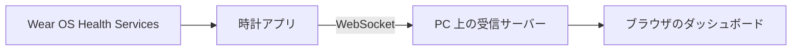

# Wear Health Data Hub

Wear OS の Health Services から健康・運動データを取得し、時計と Web ダッシュボードで確認するプロジェクトである。現在はローカル環境での収集・可視化を実装している。

## 現在の機能

- `MeasureClient` で心拍、`PassiveMonitoringClient` で日常データ、`ExerciseClient` で運動中のデータを取得する。取得できるデータ型は時計の対応状況と権限によって異なる。
- 時計に表示した 8 桁のコードでブラウザを紐付け、端末ごとの最新値とグラフを表示する。
- 紐付けた端末の受信履歴を、取得元とデータ型ごとに整理した JSON でダウンロードする。
- 受信履歴はサーバーのメモリに保持する。サーバーを再起動すると履歴は消える。

公開サーバーへの配置は未実装である。現在の debug APK は開発 PC 向けの接続先を使用するため、配布用 APK も未公開である。

## ドキュメント

- [Health Services の取得方法・データ形式・権限](docs/health-services.md)
- [ローカルダッシュボードの起動と接続](docs/local-dashboard.md)
- [Wear OS 実機への ADB インストール](docs/wear-adb-install.md)
- [配布用 APK のダウンロードとインストール](docs/apk-download.md) — 配布開始後に使用する手順
- [公開ダッシュボードの構成と残作業](docs/public-dashboard-plan.md)

## 開発者と利用条件

開発者表記は **ryo-27** である。本リポジトリ独自のコード・文書・素材にはオープンソースライセンスを付与していない。詳細は [LICENSE](LICENSE) を参照すること。第三者のライブラリや素材には、それぞれの利用条件が適用される。
