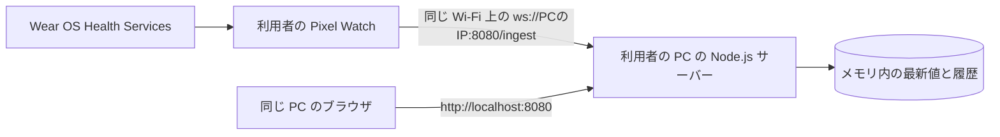

# 各 PC で動かす構成

各利用者が自分の PC で `web-ui` の Node.js サーバーを起動し、その PC のブラウザで `http://localhost:8080` を開く。共通 APK を入れた時計には、PC の IPv4 アドレスを設定する。クラウドサービスとデータベースは使用しない。

時計は初回起動時に端末固有の認証情報を生成する。PC のサーバーへ接続すると、時計に有効期間 10 分の 8 桁コードが表示される。利用者が PC のブラウザにコードを入力すると、その時計の閲覧用トークンが発行される。コードは一度だけ使用できる。

サーバーは端末とデータ型ごとに最新値と件数に上限のある履歴をメモリに保持する。ブラウザはリアルタイム表示と構造化 JSON のダウンロードを行う。サーバーを停止・再起動すると履歴と閲覧用トークンは消えるため、必要なデータは停止前に JSON で保存し、再起動後は再紐付けする。

## 運用上の制限

- PC と時計は互いに通信できるネットワークに接続する。研究室の Wi-Fi で端末間通信が遮断される場合は、接続可能なネットワークを使用する。
- PC の受信サーバーが停止している間は Web に反映されない。時計のプロセス内キューを超えたデータ、または時計アプリのプロセス終了後の再送は保証されない。
- Measure は時計アプリの画面終了時に登録を解除する。Passive の配信間隔は一定ではない。時計の画面を閉じた状態での継続収集は保証しない。
- LAN 内の `ws://` は暗号化しない。健康データを扱うため、信頼できるネットワークだけで使い、PC のポート `8080` をインターネットへ公開しない。
- PC の IP が変わったら時計の **PC の IP を変更**から設定し直す。同じ APK を使い続けられる。

起動・接続手順は [ローカル Web ダッシュボード](local-dashboard.md)、共通 APK の入手とインストールは [APK のダウンロードとインストール](apk-download.md)を参照する。
