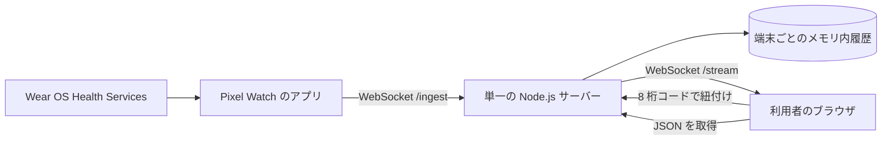

# 研究室向け公開ダッシュボードの構成と残作業

> **実装状況:** 端末ごとの紐付け、リアルタイム表示、JSON ダウンロードはローカル環境で実装済みである。公開サーバーへの配置、公開 URL を指定した APK のビルド、配布用 APK の署名と公開は未実施である。

## 現在の構成

1. 時計アプリは初回起動時に端末固有の認証情報を生成・保存し、受信サーバーへ接続する。
2. サーバーは時計へ有効期間 10 分の 8 桁コードを返す。利用者がブラウザに入力すると、その時計の閲覧用トークンが発行される。コードは一度だけ使用できる。
3. サーバーは時計のレコードを端末と指標ごとにメモリへ保持し、紐付け済みのブラウザへ配信する。時計の接続状態、最終受信時刻、受信件数も表示する。
4. 利用者は保持中のレコードを取得元とデータ型ごとに整理した JSON でダウンロードできる。別の時計を紐付けると前の閲覧用トークンを解除する。

サーバーの再起動・再デプロイで受信履歴と閲覧用トークンは消える。必要なデータは都度 JSON で保存し、再起動後は時計を再紐付けする。端末側の認証情報はアプリの保存領域に残るが、アンインストールすると失われる。時計の画面を閉じると Measure の登録が終了し、WebSocket も通常は切断される。Passive の測定・送信は OS とアプリの生存状態に依存し、常時送信は保証しない。

## 公開先

[Vercel Functions の WebSocket 対応](https://vercel.com/docs/functions/websockets)は利用可能である。ただし、複数の実行インスタンスが同じメモリを共有する保証はない。データベースや共有ストアを導入しない段階では、時計とブラウザが同じメモリを参照する**単一の常時稼働 Node.js サーバー**に、画面・API・WebSocket をまとめて配置する。

Vercel を画面の配信に使う場合も、受信サーバーは別に用意する必要がある。現行画面は同一オリジンの `/api/*` と `/stream` を使用しているため、別ホスト構成へ変更する場合は API・WebSocket の接続先と公開設定も調整する。

## 公開前の残作業

1. 常時稼働できるホストと公開ドメインを決め、HTTPS / WSS で `web-ui` を配置する。ホストが WebSocket の長時間接続に対応することを確認する。
2. 利用対象者と公開範囲を決める。現行の受信口は、端末固有の認証情報を自分で生成したクライアントの新規登録を許可する。インターネットへ公開する場合は、端末登録の制限、通信量制限、運用上のアクセス制御を追加する。
3. 実機から公開先への送受信と、複数端末でデータが混ざらないことを確認する。切断・再接続、JSON 保存、サーバー再起動後の再紐付けも確認する。
4. 公開先の `wss://.../ingest` を `HEALTH_WEBSOCKET_URL` に設定し、release APK をビルド・署名する。署名鍵とパスワードは Git に追加しない。
5. APK を GitHub Release の Asset として公開し、[ダウンロードとインストール手順](apk-download.md)を確定する。

公開前に健康データの扱いと保存・削除方針を研究室内で決める。現在のサーバーはデータベースを使用せず、JSON をダウンロードした後の保管は利用者側の管理となる。
